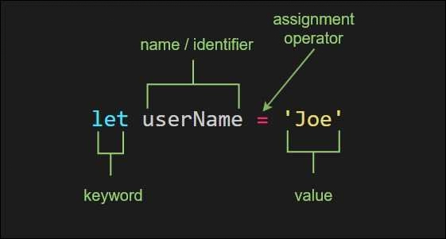
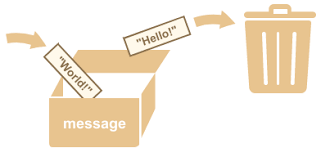

# Variables

Variables are a good place to start understanding communication between
developers and the computer. They are one tool a developer has to make a program
easier to read, and they are one way can you instruct computers to read & write
program memory.

You can think of variables
[like boxes](https://www.youtube.com/watch?v=Jvrszgiexg0) used to store data in
your programs. (_That video uses `var` but these programs use `let`. For now you
can think of them as the same thing._)

Study the JavaScript files in this folder to see the 4 main things you can do
with a variable:

- **Declaring**
- **Declaring and Initializing**
- **Assigning**
- **Reading**

---

Here's a helpful diagram of the syntax for variables in JavaScript:

[](https://blog.jordanholt.dev/learn-javascript-variables/)

---

A visual analogy for how variables work and a program it can describe:

[](https://javascript.info/variables)

```js
'use strict';

// declare the variable using let
// initialize the value: "Hello!"
let message = 'Hello!';

// assign a new value: "World!"
message = 'World!';

// read the stored value: "World!"
console.log(message);
```

---

And another little program to get you started:

```js
'use strict';

// declare the variable using let
// initialize the value: '.'
let dot = '.';

// read the stored value: '.'
// read the stored value: '.'
// assign a new value: '..'
dot = dot + dot;

// read the stored value: '..'
console.log(dot); // '..'
```
