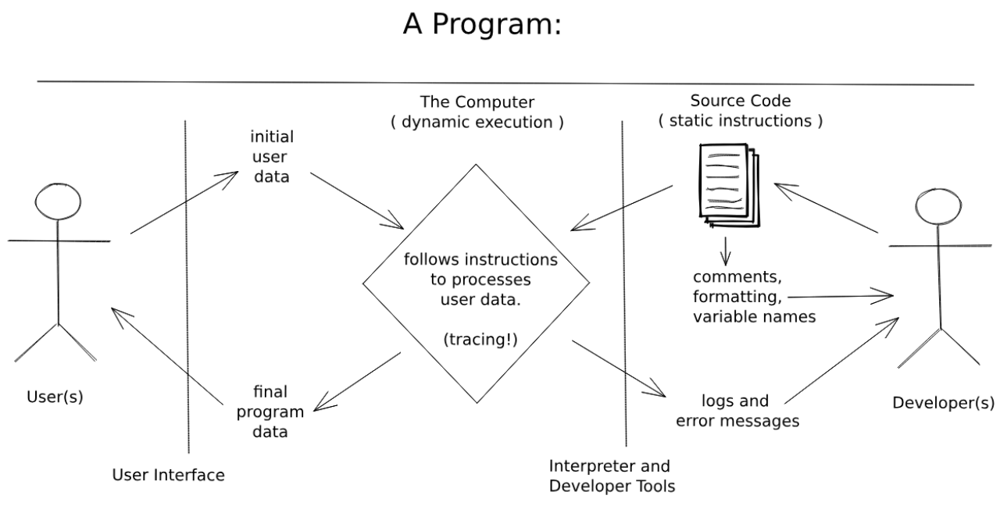

# Users

Users will use your running programs, but will never see your source code. When
writing for a user you need to think of their needs and their experience using
your program.

For now the user experience of your programs will be limited to pop-up boxes,
but that doesn't mean you can't think of UX (User Experience). A user always
appreciates  clear instructions, helpful feedback and a friendly tone in your
messages.

How does thinking of a user help you write code that they will never see? It's
about keeping the big picture in mind and making priorities. It's easy to get
caught up in the details of your code, taking a step back to remember who you're
developing for and why they need this program keeps your priorities in
perspective.

---

## Programs: Users

Users and on the left in this diagram, developers are on the right.

- **For Users**
  - **Inputting Data**: `prompt` is a simple way for users to input data to a
    JavaScript program.
  - **Outputting Data**: `alert` is a simple way for the computer to display
    data to a user.

