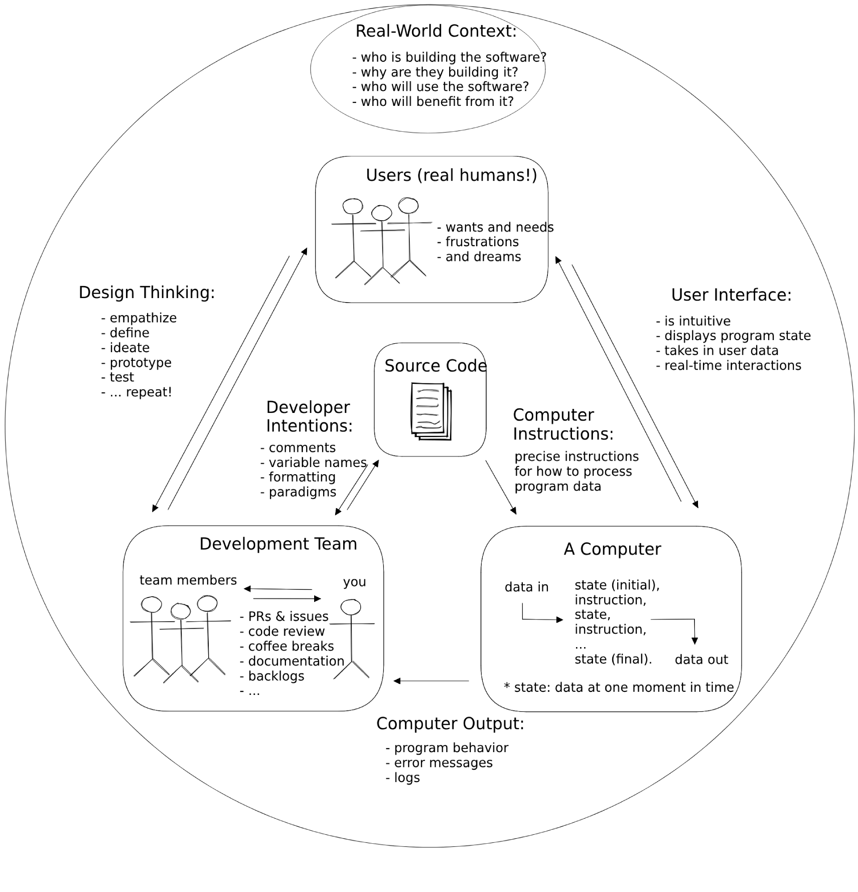
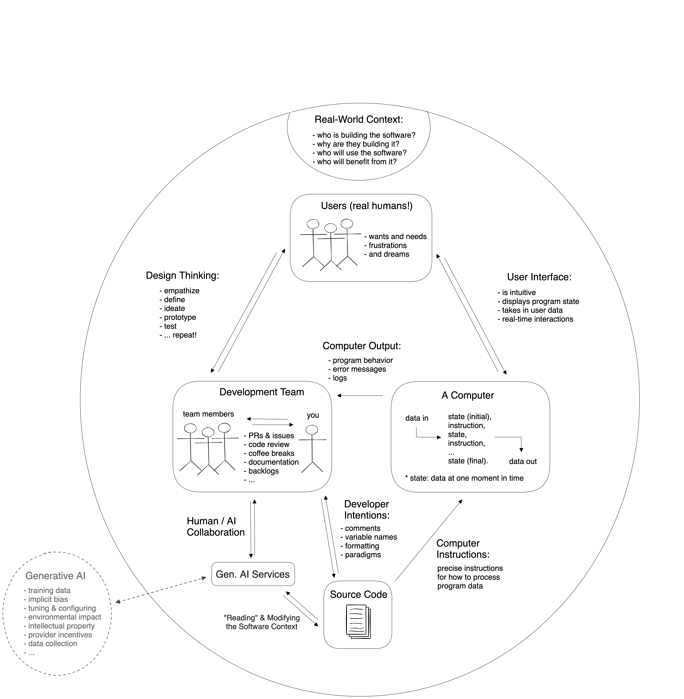
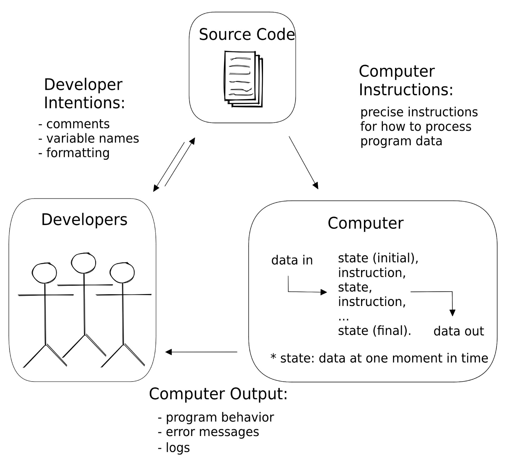

# Generative AI in the Mix

Throughout this chapter you learned to think of software development as writing
one text (your source code) for three different audiences. You learned a little
about each audience and how your source code can be used to communicate with
each:

- **Users**
- **Developers**
- **Computers**

Take a minute review how your code and the 3 audiences interact in this diagram
without generative AI

Click to expand diagram without AI

 

Then study this diagram with Generative AI in the mix before moving on to the
discussion exercises:

Click to expand diagram with AI

 

Some questions to guide your study:

- How do you think generative AI changes each person's role in this diagram?
  - Has the relationship between developers and users changed?
  - Has the relationship between users and the user interface changed?
  - Who else is impacted, but not directly included in this diagram?
  - Who in this diagram is most impacted by the presence of generative AI?
- Do you think AI fundamentally changes what it means to develop software,
  taking the whole diagram into account?
- What does gen AI's placement outside of the main circle make you think of?

---

## Thought Experiments

Based on the differences between the two diagrams above, how would you change
the following diagrams to include generative AI? And how do you think generative
AI changes the role of each

1. 

   
Programming + Generative AI

   

  

2. 

   
A Program + Generative AI

   

  

