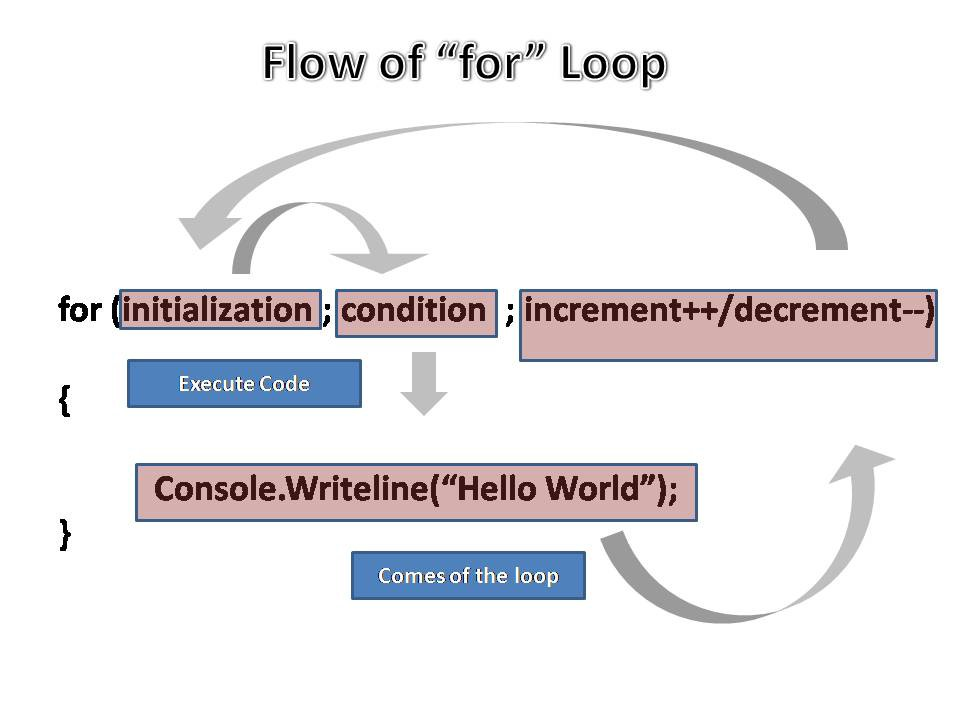

# For Loops

`for` loops are used to iterate a specific number of times. Perhaps a specific number of times (maybe `5`), or once for each item in your data (each character in a string, or each entry in an array).

<a href="https://www.freecodecamp.org/news/exploring-javascript-for-in-loops-bdfc226d8515/" target="_blank"></a>

---

## 🐣 a for loop

How are [the three parts of for loop](https://developer.mozilla.org/en-US/docs/Web/JavaScript/Reference/statements/for) conventionally used?

```js
for (initialization; condition; finalExpression) {
  // ... loop body ...
}
```

1. declare, write, test
2. declare, test, write
3. test, write, declare
4. test, declare, write

<details>
<summary>the correct answer is ...</summary>
<br>

1. declare, test, write

```js
for (
  // initialization: declare and initialize the `step` variable
  let step = 0;
  // condition: test if `step` is less than 3
  step < 3;
  //  finalExpression: add 1 to `step`
  step = step + 1
) {
  // loop body: log the current value of `step`
  console.log(step);
}
```

</details>

---

## 🐣 `while` vs. `for`

Another good way to understand how `for` loops work is to compare them to a `while` loop with a stepper variable. All of these loops will log the same thing, the `for` loop is just shorter to read:

```js
// initialization
let step = 0;
// condition
while (step < 3) {
  console.log(step);
  // final expression
  step = step + 1;
}
```

```js
// initialization; condition; finalExpression
for (let step = 0; step < 3; step = step + 1) {
  console.log(step);
}
```

There is one important difference! `step` in the `for` loop is _block scoped_, trying to access it outside the loop will throw an error (hint: try the _variables_ button):

```js
for (let step = 0; step < 3; step = step + 1) {
  console.log(step);
}

step; // ReferenceError
```
